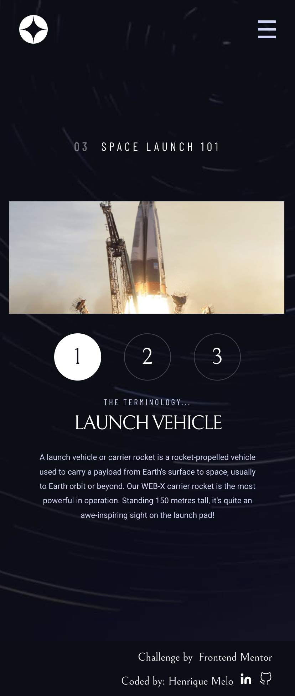

# Frontend Mentor - Space tourism website solution

This is a solution to the [Space tourism website challenge on Frontend Mentor](https://www.frontendmentor.io/challenges/space-tourism-multipage-website-gRWj1URZ3). Frontend Mentor challenges help you improve your coding skills by building realistic projects. 

## Table of contents

  - [Overview](#overview)
    - [The challenge](#the-challenge)
    - [Screenshot](#screenshot)
    - [Links](#links)
  - [My process](#my-process)
    - [Built with](#built-with)
    - [What I learned](#what-i-learned)
    - [Continued development](#continued-development)
  - [Author](#author)

## Overview

### The challenge

Users should be able to:

- View the optimal layout for each of the website's pages depending on their device's screen size
- See hover states for all interactive elements on the page
- View each page and be able to toggle between the tabs to see new information

### Screenshot

### Links

- Solution URL: [GitHub](https://github.com/HenriqueAmorim20/space-tourism)
- Live Site URL: [Web](https://melohenrique-spacetourism.netlify.app/)

## My process

### Built with

- Semantic HTML5 markup
- CSS custom properties
- Flexbox
- CSS Grid
- Mobile-first workflow
- [VueJS](https://vuejs.org/) - JS library
- [Nuxt.js](https://nuxtjs.org/) - VueJS framework
- [Vuetify](https://vuetifyjs.com/) - Material Design Framework

### What I learned

I learned more about responsiveness, css grid, flexbox, custom hard layouts and more.

### Continued development

 I want to keep improving my knowledge in CSS GRID , flexbox, media queries, Vue Store, js objects functions and more.

## Author

- Website - [Henrique Melo](https://www.melohenrique.com)
